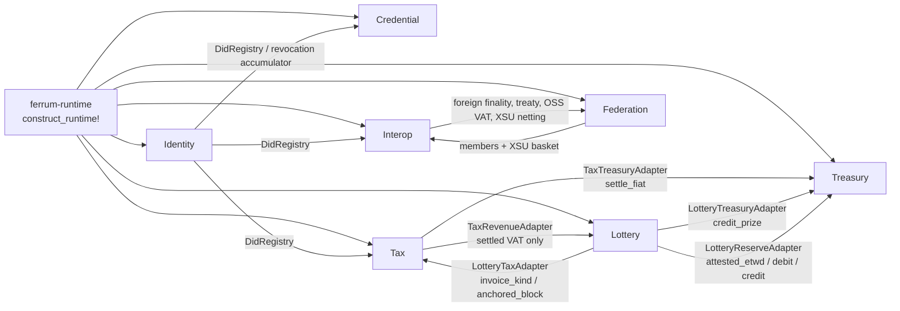
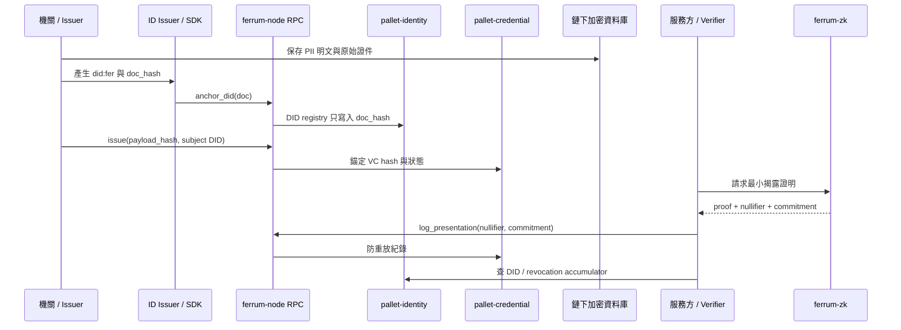
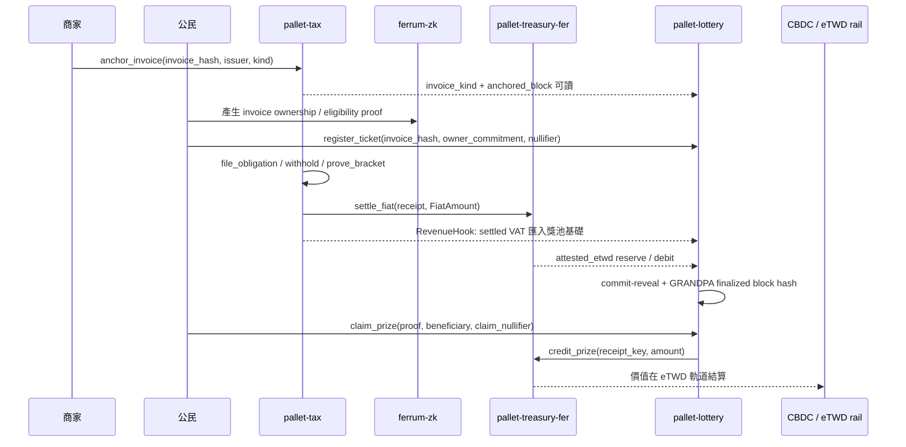
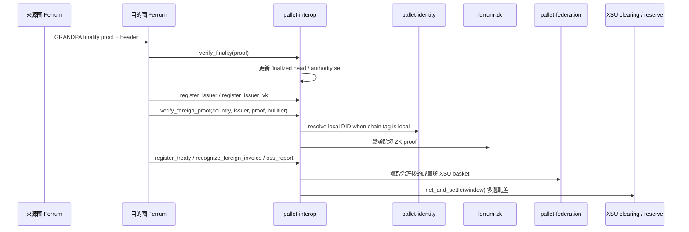

# Ferrum 系統架構圖

本圖依據 `index.html` 白皮書第 03/05/06/07/08/09/10/11 章、`README.md` 的實作分層、`runtime/src/lib.rs` 的 `construct_runtime!` 與 pallet adapter 接線，以及 `apps/*`、`sdk/*` 的實際入口整理。

## 1. 系統總覽

```mermaid
flowchart TB
    classDef actor fill:#fff7e6,stroke:#b7791f,color:#1f2933;
    classDef app fill:#e8f4ff,stroke:#2f6fb0,color:#102033;
    classDef node fill:#eaf8ef,stroke:#2f855a,color:#10251a;
    classDef runtime fill:#f2edff,stroke:#6b46c1,color:#1f1633;
    classDef pallet fill:#ffffff,stroke:#64748b,color:#111827;
    classDef lib fill:#f0fdfa,stroke:#0f766e,color:#102a27;
    classDef external fill:#f7f7f8,stroke:#71717a,color:#27272a,stroke-dasharray:4 3;

    subgraph actors["使用者與機構"]
        citizen["公民 / 錢包"]
        agency["機關 / 身分簽發者"]
        merchant["商家 / 稅務資料來源"]
        auditor["授權稽核員"]
        validator["受認證驗證者"]
        council["國內治理 / 條約理事會"]
        foreign["外國 Ferrum 主權鏈"]
    end

    subgraph apps["L5 應用與 SDK"]
        idIssuer["apps/id-issuer<br/>DID 核發終端"]
        interopConsole["apps/interop-console<br/>跨境操作主控台"]
        federationConsole["apps/federation-console<br/>聯邦治理主控台"]
        sdk["多語言 SDK<br/>Node / Python / Rust / Java / C# / Flutter"]
        dapp["Polkadot-JS / 第三方 dApp"]
    end

    subgraph node["L1/L2 ferrum-node"]
        rpc["JSON-RPC / WebSocket"]
        txpool["Transaction Pool"]
        p2p["libp2p 網路"]
        aura["Aura 3 秒出塊"]
        grandpa["GRANDPA 最終性"]
        rocks["RocksDB / 狀態資料庫"]
    end

    subgraph runtime["L3 Runtime / 狀態"]
        wasm["WASM Runtime<br/>forkless upgrade"]
        system["System / Timestamp"]
        balances["Balances / TransactionPayment<br/>FER fee & bond"]
        trie["Merkle Trie 狀態根"]
    end

    subgraph pallets["L4 Ferrum Pallets"]
        identity["Identity<br/>did:fer, doc_hash, revocation"]
        credential["Credential<br/>VC anchor, presentation nullifier"]
        tax["Tax<br/>e-invoice, obligation, bracket proof, audit"]
        treasury["Treasury<br/>FER pools, eTWD receipts, attested reserve"]
        lottery["Lottery<br/>invoice ticket, commit-reveal, eTWD prize receipt"]
        federation["Federation<br/>council, dual-majority, XSU basket"]
        interop["Interop<br/>GRANDPA light client, trust registry, treaties, XSU netting"]
    end

    subgraph libs["共用密碼與型別 crate"]
        primitives["ferrum-primitives<br/>Did, Hash32, FiatAmount, XSU, GRANDPA proof"]
        zk["ferrum-zk<br/>Groth16/BLS12-381, BBS+ selective disclosure"]
    end

    subgraph external["鏈下與外部系統"]
        vault["機關加密資料庫<br/>PII 明文只在鏈下"]
        cbdc["CBDC / eTWD 軌道<br/>實際價值移轉"]
        foreignProof["外國鏈最終性證明<br/>headers + GRANDPA precommits"]
        xsuReserve["XSU 準備池 / 多邊清算"]
    end

    agency --> idIssuer
    citizen --> sdk
    merchant --> sdk
    auditor --> sdk
    council --> federationConsole
    council --> interopConsole
    dapp --> rpc
    idIssuer -->|anchor_did| rpc
    interopConsole -->|跨境 extrinsics| rpc
    federationConsole -->|治理 extrinsics| rpc
    sdk -->|SCALE extrinsics / storage queries| rpc

    rpc <--> txpool
    txpool <--> p2p
    txpool --> aura
    validator --> aura
    validator --> grandpa
    aura -->|執行區塊| wasm
    grandpa -->|finalize| trie
    wasm --> system
    wasm --> balances
    wasm --> identity
    wasm --> credential
    wasm --> tax
    wasm --> treasury
    wasm --> lottery
    wasm --> federation
    wasm --> interop
    system --> trie
    balances --> trie
    identity --> trie
    credential --> trie
    tax --> trie
    treasury --> trie
    lottery --> trie
    federation --> trie
    interop --> trie
    trie --> rocks

    primitives -.shared types.-> identity
    primitives -.shared types.-> credential
    primitives -.shared types.-> tax
    primitives -.shared types.-> treasury
    primitives -.shared types.-> lottery
    primitives -.shared types.-> federation
    primitives -.shared types.-> interop
    zk -.proof verify.-> identity
    zk -.proof verify.-> credential
    zk -.proof verify.-> tax
    zk -.proof verify.-> lottery
    zk -.proof verify.-> interop

    vault -.hash / commitment only.-> identity
    vault -.payload_hash / doc_hash.-> credential
    vault -.invoice_hash / viewing key commitment.-> tax
    tax -->|settle_fiat / revenue hook| treasury
    tax -->|invoice anchors + settled VAT| lottery
    treasury -->|attested reserve / receipts| cbdc
    lottery -->|prize receipt key| treasury
    federation -->|members / basket governance| interop
    interop -->|XSU net position| xsuReserve
    foreign --> foreignProof
    foreignProof -->|verify_finality / rotate_authority_set| interop
    interop -->|trust registry / treaty / foreign proof| foreign

    class citizen,agency,merchant,auditor,validator,council,foreign actor;
    class idIssuer,interopConsole,federationConsole,sdk,dapp app;
    class rpc,txpool,p2p,aura,grandpa,rocks node;
    class wasm,system,balances,trie runtime;
    class identity,credential,tax,treasury,lottery,federation,interop pallet;
    class primitives,zk lib;
    class vault,cbdc,foreignProof,xsuReserve external;
```

## 2. Runtime pallet 接線

## 3. 主要資料流

### A. 身分與可驗證憑證

### B. 稅務、eTWD 與電子發票開獎

### C. 跨境互通與 XSU 清算

## 4. 架構不變式

- 鏈上只保存 `Hash32`、`Commitment`、`Nullifier`、DID 文件雜湊、VC payload 雜湊、發票雜湊、收據承諾與最終性/ZK 證明；PII 明文保留在機關鏈下加密資料庫。
- 共識是 PoSA：Aura 依 3 秒 slot 出塊，GRANDPA 提供 BFT 最終性；驗證者集合與關鍵參數由治理控制。
- FER 用於 fee、bond、slashing、pool accounting；稅款與開獎獎金以 eTWD / fiat amount 記帳，價值移轉走 CBDC 軌道。
- 跨境信任根不是託管橋，而是各鏈在 `pallet-interop` 內驗證對方 GRANDPA finality proof，再疊加 trust registry、issuer VK、treaty registry 與 XSU netting。
- `pallet-lottery` 是稅務層的延伸：票券來源必須是 `pallet-tax` 已錨定且可驗證的電子發票，獎池基礎來自已結算 VAT revenue hook，給付透過 `pallet-treasury-fer` 的去識別化 eTWD receipt。
